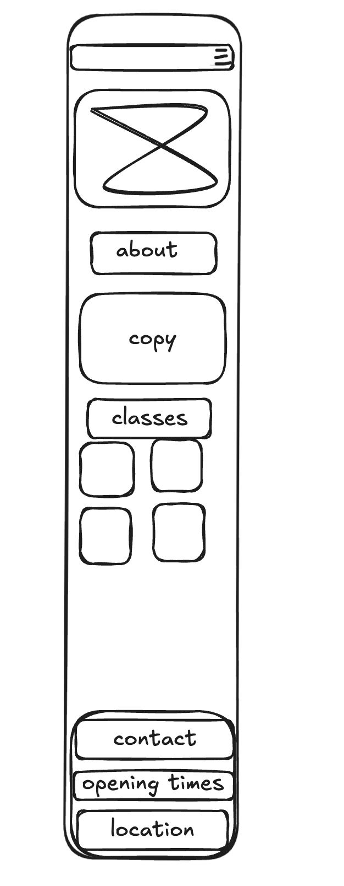
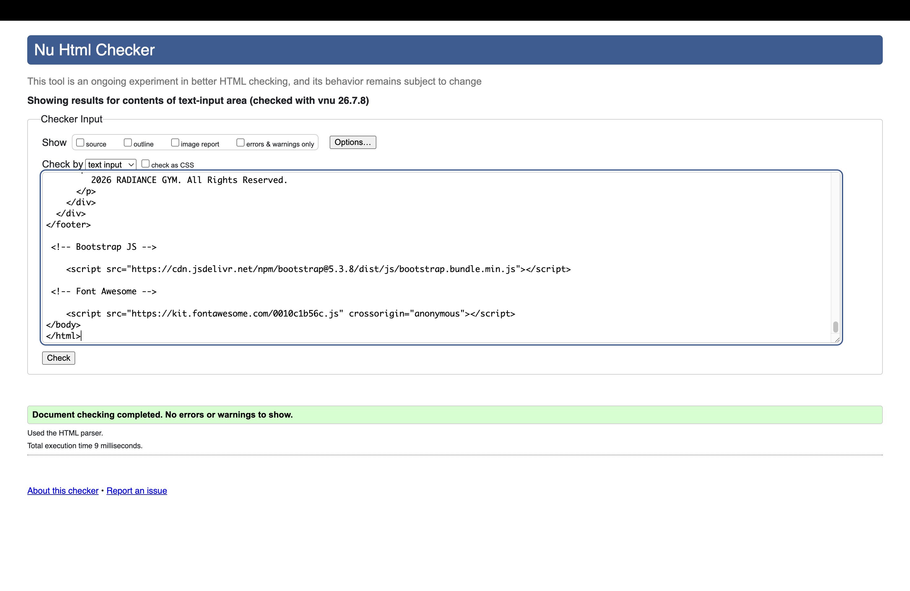
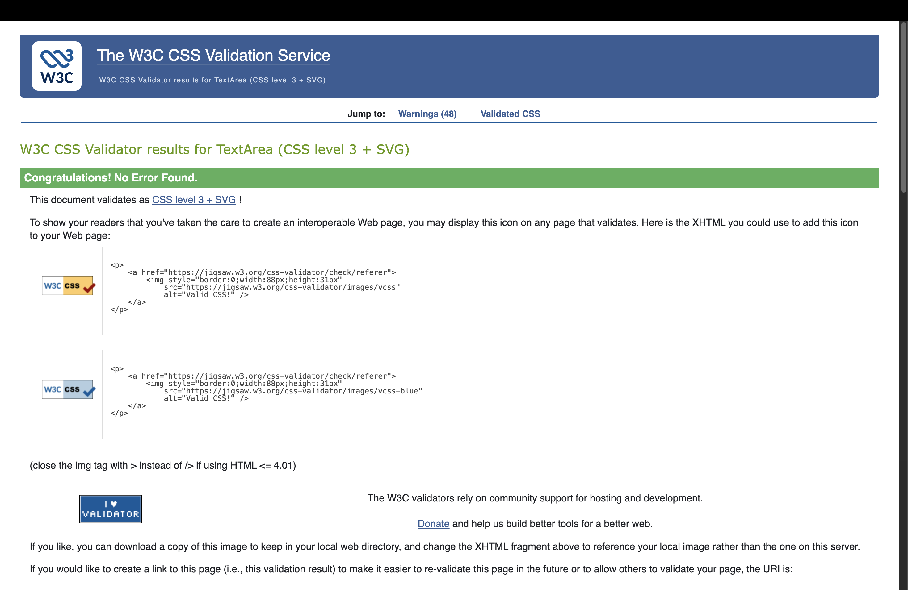
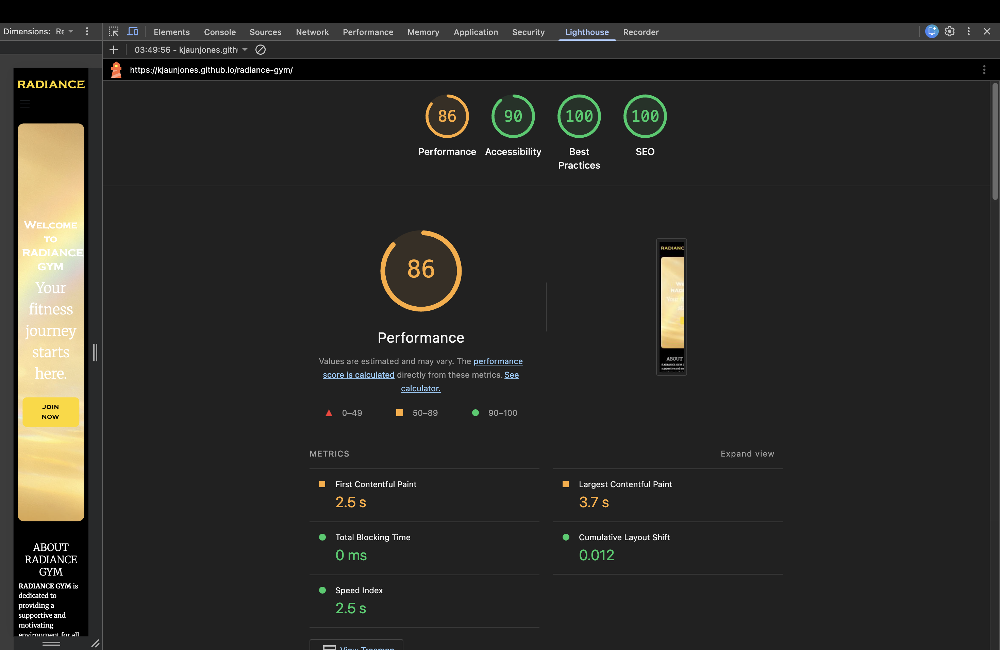

Radiance Gym Website

⸻

Project Overview

Radiance Gym is a responsive front-end web application designed for a modern fitness centre.

The purpose of this website is to provide potential and existing gym members with an easy-to-use platform where they can discover gym facilities, explore membership options, view services, and contact the business.

The website has been designed using user-centred design principles, focusing on:

* Accessibility
* Responsive design
* Clear navigation
* Structured information hierarchy
* Positive user experience

Target Audience

The target audience for this website includes:

* New customers looking for a gym membership.
* Existing members wanting information about facilities and services.
* Fitness-focused users looking for a professional training environment.

⸻

User Stories

New Visitor

As a potential gym member, I want to understand what Radiance Gym offers so that I can decide whether it meets my fitness goals.

Acceptance Criteria

* The purpose of the website is immediately clear.
* Services and facilities are easy to locate.
* Membership information is clearly presented.

⸻

Existing Member

As an existing member, I want to quickly find important information so that I can access gym details without difficulty.

Acceptance Criteria

* Navigation is simple and consistent.
* Contact information is easy to find.
* The website works correctly across different devices.

⸻

Mobile User

As a user accessing the website on a mobile device, I want the layout to adapt correctly so that I can easily browse the content.

Acceptance Criteria

* Content scales correctly.
* Navigation remains usable.
* Images and text remain readable.

⸻

User Experience Design

Design Goals

The main goals of the website design were:

* Create a professional fitness brand identity.
* Make important information easy to find.
* Provide a visually consistent experience.
* Ensure accessibility across different devices.

⸻

Design Decisions

Colour Scheme

The website uses a black and gold colour palette.

The reasons for this choice were:

* Black creates a premium and professional appearance.
* Gold provides contrast and highlights important actions.
* The colour combination supports the luxury fitness brand identity.

⸻

Typography

Typography choices were made to create a strong visual identity while maintaining readability.

The website uses:

* Bold display typography for headings.
* Readable fonts for body content.

⸻

Information Hierarchy and Layout

The website follows a structured information layout:

1. Header and navigation
2. Hero section
3. Facilities and services
4. Membership information
5. Contact information
6. Footer

This ensures users can quickly understand the purpose of the website.

⸻

Accessibility

Accessibility considerations implemented include:

* Semantic HTML elements.
* Alternative text for images.
* Appropriate colour contrast.
* Clear heading structure.
* Responsive layouts.
* Readable typography.

⸻

Features

Navigation

The website includes a consistent navigation system allowing users to access different pages easily.

Implemented features:

* Responsive navigation bar.
* Clear page structure.
* Intuitive navigation.

⸻

Responsive Design

The website has been developed to work across:

* Desktop computers
* Tablets
* Mobile devices

Responsive techniques used:

* CSS media queries.
* Bootstrap responsive utilities.
* Flexible layouts.
* Responsive images.

⸻

Interactive Elements

Implemented interaction includes:

* Navigation links.
* Button hover effects.
* User-controlled actions.

Future improvements include:

* Membership calculator.
* Online booking system.
* Contact form validation.
* Interactive timetable.

⸻

Technologies Used

Languages

* HTML5
* CSS3

Frameworks

* Bootstrap 5

External Resources

Google Fonts:

https://fonts.google.com/

Bootstrap:

https://getbootstrap.com/

⸻

Project Structure

radiance-gym/
├── index.html
├── membership.html
├── contact.html
│
├── assets/
│   ├── css/
│   │   └── style.css
│   │
│   ├── images/
│   │
│   └── favicon/
│
└── README.md

⸻

Development Process

Planning

Research was completed into:

* Modern fitness websites.
* User expectations.
* Responsive design principles.
* Branding approaches.

Wireframes were created to plan:

* Page layout.
* Content placement.
* User journey.

⸻

Development

The website was developed using:

* Semantic HTML.
* External CSS.
* Responsive design techniques.
* Git version control.

Development stages:

1. Created HTML structure.
2. Developed navigation.
3. Added styling and branding.
4. Implemented responsive layouts.
5. Tested functionality.
6. Fixed issues.
7. Deployed final version.

⸻

Code Quality and Organisation

The project follows maintainable coding practices:

* HTML and CSS are separated.
* CSS is stored externally.
* Files are organised into directories.
* Naming conventions are consistent.
* CSS sections are commented.
* Semantic HTML is used.

<header>
<nav>
<main>
<section>
<footer>

⸻

External Code Attribution

Bootstrap

Bootstrap was used as an external framework to support responsive layouts.

Source:

https://getbootstrap.com/

Google Fonts

Google Fonts were used for typography.

Source:

https://fonts.google.com/

⸻

Acknowledgements and Learning Resources

During development, resources including ChatGPT, Stack Overflow, Google, Code Institute materials and YouTube tutorials were used for learning, troubleshooting and improving code quality.

These resources helped with:

* Understanding development concepts.
* Debugging issues.
* Improving coding practices.
* Researching solutions.

⸻

Testing

Testing was completed throughout development to ensure:

* Functionality worked correctly.
* Navigation worked correctly.
* Layout remained responsive.
* Images loaded correctly.
* Broken links were removed.

⸻

Manual Testing Results

Test	Expected Result	Result
Navigation links	All pages open correctly	PASS
Images	Images load correctly	PASS
Buttons	Hover effects work correctly	PASS
Mobile layout	Website adapts correctly	PASS
Desktop layout	Website maintains structure	PASS
External links	Links open correctly	PASS
Accessibility	Content remains readable	PASS

⸻

Automated Testing

HTML Validation

HTML was tested using the W3C HTML Validator.

Evidence:

Result:

PASS

⸻

CSS Validation

CSS was tested using the W3C CSS Validator.

Evidence:

Result:

PASS

⸻

Lighthouse Testing

Google Lighthouse was used to test:

* Performance
* Accessibility
* Best Practices
* SEO

Evidence:

⸻

Broken Link Testing

Dead Link Checker was used to identify broken links within the website.

Evidence:

Result:

PASS

⸻

Bug Testing and Fixes

Bug 1

Issue

INSERT BUG DESCRIPTION

Cause

INSERT CAUSE

Solution

INSERT FIX

Evidence:

⸻

GitHub Version Control

The project was developed using Git and GitHub.

Repository:

https://github.com/kjaunjones/radiance-gym

Example commit messages:

Created homepage structure
Added responsive navigation
Updated hero section styling
Fixed image loading issue
Improved mobile layout

⸻

Deployment

The website was deployed using GitHub Pages.

Deployment process:

1. Uploaded project files to GitHub.
2. Enabled GitHub Pages.
3. Selected the main branch.
4. Tested the deployed website.

Live website:

https://kjaunjones.github.io/radiance-gym/

⸻

Deployment Testing

The deployed website was tested to ensure:

* All pages load correctly.
* Images display correctly.
* Navigation works.
* Layout matches the development version.
* No broken links exist.

⸻

Future Improvements

Potential improvements include:

* Adding JavaScript functionality.
* Adding membership calculations.
* Adding online booking.
* Adding customer accounts.
* Adding a timetable system.
* Improving interaction feedback.

⸻

Conclusion

Radiance Gym demonstrates the development of a responsive front-end web application using HTML and CSS.

The project focuses on:

* User experience.
* Accessibility.
* Responsive design.
* Maintainable code structure.
* Professional documentation.

Testing and documentation provide evidence of the complete development lifecycle from planning through to deployment.